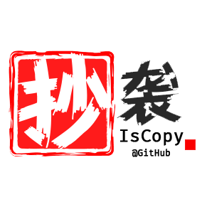

<h1 align="center"> IsCopy/你抄了吗 </h1>
<p align="center">
	<br/>
    
    
    <a href="https://github.com/WhiteRobe/iscopy/blob/master/LICENSE">
    	
    </a>
    <a href="https://zenodo.org/badge/latestdoi/214223313"></a>
    
</p>

> 这是一个开发中的代码重复度检测框架。
>
> 目前版本仅实现了最基础的代码查重方式。

## 依赖 | Dependency

我希望引入尽量少的依赖，目前的依赖：

- pandas
- pygments

## 快速上手 | Quick Start

```shell
python anly.py --input ./demo --filename demo-data.py --template ./demo/template/demo-data.py
```

## 架构 | Structure

- `analyser`：主要的分析器
- `extractor`：特征提取器
- `purifier`：代码规格化

## 检测效果 | Performance

<p align="center">
    
</p>

